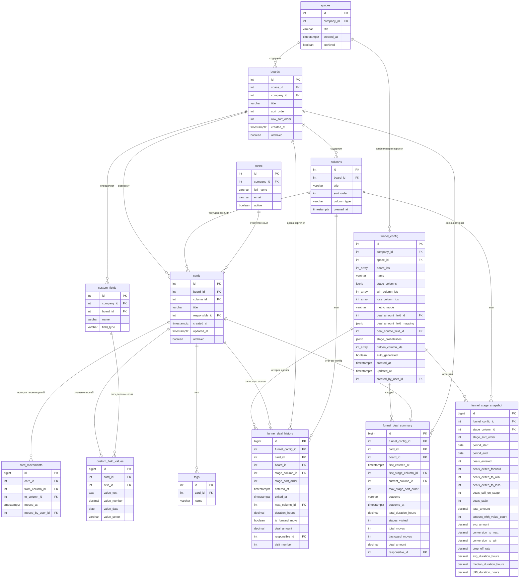

# Модель данных: Отчёт «Воронка продаж»

## История изменений

| Дата | Версия | Автор | Описание |
|------|--------|-------|----------|
| 2026-02-26 | 2.0 | business-analyst | **MAJOR UPDATE по фидбеку CPO.** Переход с board-level на space-level scoping: `board_id` -> `space_id` + `board_ids[]`. Новая исходная сущность `spaces`. Новые поля в `funnel_config`: `metric_mode`, `auto_generated`, `deal_amount_field_mapping`, `hidden_column_ids`. Добавлен `board_id` в `funnel_deal_history` и `funnel_deal_summary` для cross-board аналитики. Обновлена ER-диаграмма (Mermaid). Обновлены индексы для multi-board запросов. Пересчитаны оценки объёмов. Источники: `cpo-feedback-changelog.md`, `best-guess-algorithm.md`, `multi-board-unification.md`. |
| 2026-02 | 1.0 | business-analyst | Первоначальная версия. Single-board модель. |

---

## Общее описание

Данный документ описывает модель данных, необходимую для расчёта метрик отчёта «Воронка продаж» в Kaiten CRM. Модель состоит из двух слоёв:

1. **Исходные сущности** -- существующие таблицы Kaiten, из которых извлекаются данные
2. **Аналитические сущности** -- производные таблицы/представления, спроектированные для эффективного расчёта метрик

**Ключевое архитектурное решение (v2.0):** Воронка строится на уровне **пространства** (`space_id`), а не отдельной доски. Одно пространство может содержать несколько досок, колонки которых объединяются в единую последовательность этапов. Подробности -- в `data-model/multi-board-unification.md`.

---

## 1. Исходные сущности (из Kaiten)

### 1.1. spaces -- Пространства

Пространство -- корневая организационная единица в Kaiten. Содержит одну или несколько досок. В контексте воронки продаж **одно пространство = одна воронка**. Все доски пространства объединяются в единый поток этапов.

| Поле | Тип | Описание | Nullable | Пример |
|------|-----|----------|----------|--------|
| `id` | integer | PK, уникальный идентификатор пространства | Нет | `42` |
| `company_id` | integer | FK на компанию-владельца | Нет | `7` |
| `title` | varchar(255) | Название пространства | Нет | `CRM` |
| `created_at` | timestamptz | Дата создания | Нет | `2024-01-10T08:00:00Z` |
| `archived` | boolean | Флаг архивации | Нет | `false` |

**Что нужно для отчёта:** `id`, `company_id`, `title`. Пространство определяет scope воронки. Отчёт строится по пространству, автоматически включая все неархивные доски. Архивные пространства доступны для исторических отчётов.

**Связь:** `spaces (1) ----< (N) boards` -- одно пространство содержит много досок.

---

### 1.2. boards -- Доски

Доска -- контейнер для карточек с настраиваемой структурой колонок. Несколько досок одного пространства объединяются в единую воронку. Порядок досок определяется их расположением в пространстве (строка + позиция в строке).

| Поле | Тип | Описание | Nullable | Пример |
|------|-----|----------|----------|--------|
| `id` | integer | PK, уникальный идентификатор доски | Нет | `1042` |
| `space_id` | integer | FK на пространство | Нет | `42` |
| `company_id` | integer | FK на компанию-владельца | Нет | `7` |
| `title` | varchar(255) | Название доски | Нет | `Продажи B2B` |
| `sort_order` | integer | Порядок доски в строке (слева направо) | Нет | `1` |
| `row_sort_order` | integer | Порядок строки в пространстве (сверху вниз) | Нет | `1` |
| `created_at` | timestamptz | Дата создания доски | Нет | `2024-03-15T10:00:00Z` |
| `archived` | boolean | Флаг архивации | Нет | `false` |

**Что нужно для отчёта:** `id`, `space_id`, `company_id`, `title`, `sort_order`, `row_sort_order`, `archived`. Отчёт строится по всем неархивным доскам пространства. Порядок досок (`row_sort_order` ASC, `sort_order` ASC) определяет глобальный порядок этапов воронки при линеаризации (сверху вниз, слева направо). Архивные доски исключаются из автоконфигурации, но доступны для исторических отчётов.

---

### 1.3. columns -- Колонки доски

Колонки определяют этапы процесса на доске. Порядок колонок задаёт порядок этапов воронки.

| Поле | Тип | Описание | Nullable | Пример |
|------|-----|----------|----------|--------|
| `id` | integer | PK | Нет | `5001` |
| `board_id` | integer | FK на доску | Нет | `1042` |
| `title` | varchar(255) | Название колонки | Нет | `Квалификация` |
| `sort_order` | integer | Порядок колонки на доске (слева направо) | Нет | `2` |
| `column_type` | varchar(50) | Тип колонки (queue, in_progress, done) | Да | `in_progress` |
| `created_at` | timestamptz | Дата создания | Нет | `2024-03-15T10:00:00Z` |

**Что нужно для отчёта:** `id`, `board_id`, `title`, `sort_order`, `column_type`. Порядок колонок внутри доски определяется `sort_order`. Глобальный порядок этапов воронки определяется комбинацией порядка доски и порядка колонки. Колонки с `column_type = 'done'` используются алгоритмом Best Guess для автоопределения won/lost (см. `research/best-guess-algorithm.md`). Пользователь может переопределить порядок и скрыть отдельные колонки в настройке воронки.

---

### 1.4. cards -- Карточки (сделки)

Карточка -- основная единица работы в Kaiten. В контексте CRM карточка = сделка.

| Поле | Тип | Описание | Nullable | Пример |
|------|-----|----------|----------|--------|
| `id` | integer | PK | Нет | `98765` |
| `board_id` | integer | FK на доску | Нет | `1042` |
| `column_id` | integer | FK на текущую колонку | Нет | `5003` |
| `title` | varchar(500) | Название сделки | Нет | `Контракт с Газпром` |
| `responsible_id` | integer | FK на ответственного пользователя | Да | `301` |
| `created_at` | timestamptz | Дата создания карточки | Нет | `2024-06-01T09:30:00Z` |
| `updated_at` | timestamptz | Дата последнего обновления | Нет | `2024-06-15T14:20:00Z` |
| `archived` | boolean | Флаг архивации | Нет | `false` |

**Что нужно для отчёта:** `id`, `board_id`, `column_id`, `responsible_id`, `created_at`, `archived`. Поле `board_id` критично для multi-board воронки: определяет, к какой доске пространства принадлежит карточка, что влияет на маппинг полей суммы и глобальный порядок этапов. Текущая `column_id` используется для snapshot-метрик (объём воронки). Архивные карточки могут включаться/исключаться по настройке.

---

### 1.5. card_movements -- История перемещений карточек

Лог всех перемещений карточек между колонками. Основной источник данных для расчёта метрик воронки.

| Поле | Тип | Описание | Nullable | Пример |
|------|-----|----------|----------|--------|
| `id` | bigint | PK | Нет | `445566` |
| `card_id` | integer | FK на карточку | Нет | `98765` |
| `from_column_id` | integer | FK на колонку-источник | Да | `5001` (null = создание карточки) |
| `to_column_id` | integer | FK на колонку-назначение | Нет | `5002` |
| `moved_at` | timestamptz | Время перемещения | Нет | `2024-06-05T11:45:00Z` |
| `moved_by_user_id` | integer | FK на пользователя, выполнившего перемещение | Да | `301` |

**Что нужно для отчёта:** Все поля. Это ключевая таблица для расчёта:
- Время входа/выхода с этапа
- Последовательность этапов для каждой сделки
- Конверсии между этапами
- Определение потерянных сделок

**Важно:** `from_column_id = NULL` означает создание карточки непосредственно в колонке `to_column_id`.

---

### 1.6. custom_field_values -- Значения кастомных полей

Хранит значения пользовательских полей карточек (сумма сделки, источник и т.д.).

| Поле | Тип | Описание | Nullable | Пример |
|------|-----|----------|----------|--------|
| `id` | bigint | PK | Нет | `777888` |
| `card_id` | integer | FK на карточку | Нет | `98765` |
| `field_id` | integer | FK на определение кастомного поля | Нет | `201` |
| `value_text` | text | Текстовое значение | Да | `Холодный звонок` |
| `value_number` | decimal(18,2) | Числовое значение | Да | `350000.00` |
| `value_date` | date | Дата | Да | `2024-07-15` |
| `value_select` | varchar(255) | Значение из списка | Да | `enterprise` |

**Что нужно для отчёта:**
- Поле «Сумма сделки» (`value_number`) -- для расчёта объёма, среднего чека, velocity
- Поле «Источник» (`value_text` или `value_select`) -- для фильтрации и группировки
- Поле «Дата закрытия» (`value_date`) -- если используется вместо/вместе с датой перемещения в win/loss

---

### 1.7. custom_fields -- Определения кастомных полей

Метаданные кастомных полей: название, тип, к какой доске привязаны.

| Поле | Тип | Описание | Nullable | Пример |
|------|-----|----------|----------|--------|
| `id` | integer | PK | Нет | `201` |
| `company_id` | integer | FK на компанию | Нет | `7` |
| `board_id` | integer | FK на доску (если поле привязано к доске) | Да | `1042` |
| `name` | varchar(255) | Название поля | Нет | `Сумма сделки` |
| `field_type` | varchar(50) | Тип: number, text, date, select, multiselect | Нет | `number` |

**Что нужно для отчёта:** `id`, `name`, `field_type`. Используется для маппинга: какой `field_id` соответствует сумме сделки, источнику и т.д. Маппинг настраивается в `funnel_config`.

---

### 1.8. users -- Пользователи

| Поле | Тип | Описание | Nullable | Пример |
|------|-----|----------|----------|--------|
| `id` | integer | PK | Нет | `301` |
| `company_id` | integer | FK на компанию | Нет | `7` |
| `full_name` | varchar(255) | Полное имя | Нет | `Иванов Пётр` |
| `email` | varchar(255) | Email | Нет | `ivanov@company.ru` |
| `active` | boolean | Активен ли аккаунт | Нет | `true` |

**Что нужно для отчёта:** `id`, `full_name`. Для отображения имён ответственных и фильтрации по менеджеру.

---

### 1.9. tags -- Теги карточек

| Поле | Тип | Описание | Nullable | Пример |
|------|-----|----------|----------|--------|
| `id` | integer | PK | Нет | `50` |
| `card_id` | integer | FK на карточку | Нет | `98765` |
| `name` | varchar(100) | Текст тега | Нет | `enterprise` |

**Что нужно для отчёта:** `card_id`, `name`. Для фильтрации сделок по тегам.

---

## 2. Аналитические сущности (новые/производные)

### 2.1. funnel_config -- Настройка воронки

Хранит конфигурацию воронки: какое пространство, какие доски входят, какие колонки представляют этапы, какие -- победу/проигрыш, режим метрики, маппинг кастомных полей. Может быть создана автоматически алгоритмом Best Guess (см. `research/best-guess-algorithm.md`) или вручную пользователем.

| Поле | Тип | Описание | Nullable | Пример |
|------|-----|----------|----------|--------|
| `id` | integer | PK | Нет | `1` |
| `company_id` | integer | FK на компанию | Нет | `7` |
| `space_id` | integer | FK на пространство | Нет | `42` |
| `board_ids` | integer[] | Массив ID досок, входящих в воронку | Нет | `[1042, 1043]` |
| `name` | varchar(255) | Название конфигурации воронки | Нет | `Основная воронка B2B` |
| `stage_columns` | jsonb | Упорядоченный массив `{column_id, board_id, label, sort_order, stale_threshold_days}` | Нет | см. ниже |
| `win_column_ids` | integer[] | Массив ID колонок «Выигран» | Нет | `[5006]` |
| `loss_column_ids` | integer[] | Массив ID колонок «Проигран» | Нет | `[5007]` |
| `metric_mode` | varchar(20) | Режим метрики: `'count'` (по кол-ву карточек) или `'amount'` (по сумме сделки) | Нет, default `'count'` | `'count'` |
| `deal_amount_field_id` | integer | FK на custom_field, хранящий сумму сделки (общее поле для всех досок) | Да | `201` |
| `deal_amount_field_mapping` | jsonb | Маппинг `board_id -> field_id` для случаев, когда на разных досках разные поля суммы | Да | `{"1042": 201, "1043": 305}` |
| `deal_source_field_id` | integer | FK на custom_field, хранящий источник | Да | `202` |
| `stage_probabilities` | jsonb | Вероятности победы по этапам: `{column_id: probability}` | Да | `{"5001": 0.2, "5002": 0.4}` |
| `hidden_column_ids` | integer[] | Массив ID скрытых колонок (Nice to Have, см. `multi-board-unification.md` секция 3) | Да | `[5002]` |
| `auto_generated` | boolean | Конфигурация создана алгоритмом Best Guess автоматически | Нет, default `true` | `true` |
| `created_at` | timestamptz | Дата создания | Нет | `2024-03-20T12:00:00Z` |
| `updated_at` | timestamptz | Дата обновления | Нет | `2024-03-20T12:00:00Z` |
| `created_by_user_id` | integer | FK на создателя | Нет | `301` |

**Формат `stage_columns` (обновлён, добавлен `board_id`):**
```json
[
  {
    "column_id": 5001,
    "board_id": 1042,
    "label": "Квалификация",
    "sort_order": 1,
    "stale_threshold_days": 7
  },
  {
    "column_id": 5002,
    "board_id": 1042,
    "label": "Встреча",
    "sort_order": 2,
    "stale_threshold_days": 10
  },
  {
    "column_id": 6001,
    "board_id": 1043,
    "label": "Предложение",
    "sort_order": 3,
    "stale_threshold_days": 14
  },
  {
    "column_id": 6002,
    "board_id": 1043,
    "label": "Переговоры",
    "sort_order": 4,
    "stale_threshold_days": 14
  }
]
```

**Формат `deal_amount_field_mapping`:**
```json
{
  "1042": 201,
  "1043": 305
}
```
Ключ -- `board_id` (строка, т.к. ключи jsonb), значение -- `field_id` кастомного числового поля на этой доске. Используется, когда на разных досках сумма хранится в разных полях (P-007). Если задан `deal_amount_field_mapping`, для каждой карточки берётся значение из `mapping[card.board_id]`. Если задан `deal_amount_field_id` -- используется как единое поле для всех досок.

**Приоритет полей суммы:** `deal_amount_field_mapping` > `deal_amount_field_id` > `null` (режим `count`).

**Ограничения:**
- Unique constraint: `(space_id, company_id)` -- одно пространство имеет одну активную конфигурацию на компанию
- `stage_columns` не должен пересекаться с `win_column_ids` и `loss_column_ids`
- `column_id` в `stage_columns` должны принадлежать доскам из `board_ids`
- `board_ids` должны принадлежать пространству `space_id`
- `sort_order` в `stage_columns` должен быть уникальным и последовательным
- `metric_mode = 'amount'` допустим только если `deal_amount_field_id IS NOT NULL` или `deal_amount_field_mapping IS NOT NULL`
- `hidden_column_ids` должны быть подмножеством column_id из `stage_columns` (нельзя скрыть won/lost)

---

### 2.2. funnel_deal_history -- История сделки через воронку

Материализованная таблица, содержащая подготовленные данные о пребывании каждой сделки на каждом этапе воронки. Строится на основе `card_movements` и `funnel_config`. В multi-board воронке содержит записи о карточках **со всех досок пространства**, что позволяет анализировать сквозной путь сделки через несколько досок.

| Поле | Тип | Описание | Nullable | Пример |
|------|-----|----------|----------|--------|
| `id` | bigint | PK, автоинкремент | Нет | `100001` |
| `funnel_config_id` | integer | FK на конфигурацию воронки | Нет | `1` |
| `card_id` | integer | FK на карточку (сделку) | Нет | `98765` |
| `board_id` | integer | FK на доску, которой принадлежит карточка | Нет | `1042` |
| `stage_column_id` | integer | FK на колонку-этап воронки | Нет | `5002` |
| `stage_sort_order` | integer | Глобальный порядковый номер этапа (из конфига, сквозная нумерация по всем доскам) | Нет | `2` |
| `entered_at` | timestamptz | Время входа на этап | Нет | `2024-06-05T11:45:00Z` |
| `exited_at` | timestamptz | Время выхода с этапа | Да | `2024-06-08T09:15:00Z` (null = ещё на этапе) |
| `next_column_id` | integer | FK на колонку, куда ушла сделка | Да | `5003` (null = ещё на этапе) |
| `duration_hours` | decimal(10,2) | Время пребывания в часах | Да | `69.50` (null = ещё на этапе) |
| `is_forward_move` | boolean | Перемещение вперёд по воронке (true) или назад (false) | Да | `true` (null = ещё на этапе) |
| `deal_amount` | decimal(18,2) | Сумма сделки на момент входа на этап (из общего поля или маппинга по доске) | Да | `350000.00` |
| `responsible_id` | integer | FK на ответственного | Да | `301` |
| `visit_number` | integer | Номер визита на этот этап (1 = первый, 2 = повторный вход) | Нет | `1` |

**Правила заполнения:**
- Создаётся одна запись на каждое пребывание сделки на этапе
- Если сделка вошла на этап, ушла и вернулась -- создаётся вторая запись с `visit_number = 2`
- `exited_at` заполняется при следующем перемещении карточки
- `is_forward_move`: `true` если `next_column` имеет больший `sort_order` или является win; `false` если меньший `sort_order` или loss
- `duration_hours` = `EXTRACT(EPOCH FROM exited_at - entered_at) / 3600`
- `board_id` берётся из `cards.board_id` -- показывает, на какой доске находится карточка. Критично для: маппинга поля суммы (разные поля на разных досках), фильтрации по конкретной доске внутри воронки, диагностики cross-board аналитики
- `deal_amount` заполняется с учётом `deal_amount_field_mapping` или `deal_amount_field_id` из конфига (приоритет: маппинг по `board_id` > общее поле > null)

**Индексы:**
- `(funnel_config_id, card_id, entered_at)` -- поиск истории сделки
- `(funnel_config_id, stage_column_id, entered_at)` -- агрегация по этапу за период
- `(funnel_config_id, card_id, stage_sort_order)` -- определение максимального достигнутого этапа
- `(funnel_config_id, board_id)` -- фильтрация по конкретной доске внутри multi-board воронки

---

### 2.3. funnel_stage_snapshot -- Агрегаты по этапу за период

Предрассчитанная (или на лету рассчитываемая) таблица с агрегированными метриками для каждого этапа за каждый период. В multi-board воронке агрегаты строятся по глобальным этапам (объединяющим колонки нескольких досок). Поля `total_amount`, `avg_amount` заполняются только при `metric_mode = 'amount'`; при `metric_mode = 'count'` эти поля = `null`.

| Поле | Тип | Описание | Nullable | Пример |
|------|-----|----------|----------|--------|
| `id` | bigint | PK | Нет | `500001` |
| `funnel_config_id` | integer | FK на конфигурацию воронки | Нет | `1` |
| `stage_column_id` | integer | FK на колонку-этап | Нет | `5002` |
| `stage_sort_order` | integer | Порядковый номер этапа | Нет | `2` |
| `period_start` | date | Начало периода | Нет | `2024-06-01` |
| `period_end` | date | Конец периода | Нет | `2024-06-30` |
| `deals_entered` | integer | Кол-во уникальных сделок, вошедших на этап | Нет | `120` |
| `deals_exited_forward` | integer | Кол-во сделок, ушедших вперёд | Нет | `80` |
| `deals_exited_to_win` | integer | Кол-во сделок, ушедших в win | Нет | `0` |
| `deals_exited_to_loss` | integer | Кол-во сделок, ушедших в loss | Нет | `20` |
| `deals_still_on_stage` | integer | Кол-во сделок, ещё на этапе на `period_end` | Нет | `20` |
| `deals_stale` | integer | Кол-во зависших сделок на `period_end` | Нет | `5` |
| `total_amount` | decimal(18,2) | Сумма сделок, вошедших на этап | Да | `15200000.00` |
| `amount_with_value_count` | integer | Кол-во сделок с заполненной суммой | Нет | `95` |
| `avg_amount` | decimal(18,2) | Средний чек | Да | `160000.00` |
| `conversion_to_next` | decimal(5,4) | Конверсия в следующий этап (0.0000 - 1.0000) | Да | `0.6667` |
| `conversion_to_win` | decimal(5,4) | Конверсия в win | Да | `0.2500` |
| `drop_off_rate` | decimal(5,4) | Коэффициент потерь | Да | `0.1667` |
| `avg_duration_hours` | decimal(10,2) | Среднее время на этапе (часы) | Да | `100.80` |
| `median_duration_hours` | decimal(10,2) | Медианное время на этапе (часы) | Да | `72.00` |
| `p90_duration_hours` | decimal(10,2) | 90-й перцентиль времени | Да | `240.00` |

**Обновление:**
- Может рассчитываться на лету (для малых объёмов, до 10 000 карточек)
- Может предрассчитываться по крону (для больших объёмов) с гранулярностью: день, неделя, месяц
- При предрассчёте требуется инвалидация при перемещении карточки

---

### 2.4. funnel_deal_summary -- Сводка по сделке в воронке

Одна строка на каждую сделку, прошедшую через воронку. Содержит итоговые показатели. В multi-board воронке сделка может проходить через этапы на разных досках -- `board_id` фиксирует исходную доску карточки.

| Поле | Тип | Описание | Nullable | Пример |
|------|-----|----------|----------|--------|
| `id` | bigint | PK | Нет | `200001` |
| `funnel_config_id` | integer | FK на конфигурацию воронки | Нет | `1` |
| `card_id` | integer | FK на карточку | Нет | `98765` |
| `board_id` | integer | FK на доску, которой принадлежит карточка | Нет | `1042` |
| `first_entered_at` | timestamptz | Время первого входа в воронку | Нет | `2024-06-01T09:30:00Z` |
| `first_stage_column_id` | integer | Первый этап (колонка) | Нет | `5001` |
| `current_column_id` | integer | Текущая колонка | Нет | `5003` |
| `max_stage_sort_order` | integer | Максимальный достигнутый этап (глобальный sort_order) | Нет | `3` |
| `outcome` | varchar(20) | Итог: `in_progress`, `won`, `lost` | Нет | `in_progress` |
| `outcome_at` | timestamptz | Время итога (win/loss) | Да | `null` |
| `total_duration_hours` | decimal(10,2) | Общее время в воронке (часы) | Да | `336.00` |
| `stages_visited` | integer | Кол-во уникальных этапов, которые посетила сделка | Нет | `3` |
| `total_moves` | integer | Общее кол-во перемещений | Нет | `4` |
| `backward_moves` | integer | Кол-во перемещений назад | Нет | `0` |
| `deal_amount` | decimal(18,2) | Сумма сделки (текущая, из общего поля или маппинга по доске) | Да | `350000.00` |
| `responsible_id` | integer | Ответственный | Да | `301` |

**Правила заполнения:**
- `outcome` = `won` если `current_column_id IN win_column_ids`
- `outcome` = `lost` если `current_column_id IN loss_column_ids`
- `outcome` = `in_progress` иначе
- `total_duration_hours` = `outcome_at - first_entered_at` (или `now() - first_entered_at` для in_progress)
- `backward_moves` = количество перемещений, где глобальный `sort_order` уменьшился
- `board_id` берётся из `cards.board_id`. Используется для: группировки сделок по доскам, маппинга полей суммы, фильтрации внутри multi-board воронки
- `deal_amount` заполняется с учётом `deal_amount_field_mapping` или `deal_amount_field_id` из конфига (приоритет: маппинг по `board_id` > общее поле > null). При `metric_mode = 'count'` поле может быть null

---

## 3. ER-диаграмма

### Связи между исходными сущностями

```
spaces (1) ----< (N) boards
  Одно пространство содержит много досок.
  Связь: boards.space_id -> spaces.id

boards (1) ----< (N) columns
  Одна доска содержит много колонок.
  Связь: columns.board_id -> boards.id

boards (1) ----< (N) cards
  Одна доска содержит много карточек.
  Связь: cards.board_id -> boards.id

columns (1) ----< (N) cards
  Одна колонка содержит много карточек (текущая позиция).
  Связь: cards.column_id -> columns.id

cards (1) ----< (N) card_movements
  У одной карточки много перемещений.
  Связь: card_movements.card_id -> cards.id

columns (1) ----< (N) card_movements (from)
  Колонка-источник перемещения.
  Связь: card_movements.from_column_id -> columns.id (nullable)

columns (1) ----< (N) card_movements (to)
  Колонка-назначение перемещения.
  Связь: card_movements.to_column_id -> columns.id

cards (1) ----< (N) custom_field_values
  У одной карточки много значений кастомных полей.
  Связь: custom_field_values.card_id -> cards.id

custom_fields (1) ----< (N) custom_field_values
  Одно определение поля — много значений.
  Связь: custom_field_values.field_id -> custom_fields.id

users (1) ----< (N) cards
  Один пользователь ответственен за много карточек.
  Связь: cards.responsible_id -> users.id (nullable)

cards (1) ----< (N) tags
  У одной карточки много тегов.
  Связь: tags.card_id -> cards.id
```

### Связи аналитических сущностей

```
spaces (1) ----< (N) funnel_config
  Одно пространство может иметь несколько конфигураций воронки (по одной на компанию).
  Связь: funnel_config.space_id -> spaces.id
  Unique constraint: (space_id, company_id)

funnel_config (1) ----< (N) funnel_deal_history
  Одна конфигурация — много записей истории.
  Связь: funnel_deal_history.funnel_config_id -> funnel_config.id

funnel_config (1) ----< (N) funnel_stage_snapshot
  Одна конфигурация — много снапшотов по этапам.
  Связь: funnel_stage_snapshot.funnel_config_id -> funnel_config.id

funnel_config (1) ----< (N) funnel_deal_summary
  Одна конфигурация — много сводок по сделкам.
  Связь: funnel_deal_summary.funnel_config_id -> funnel_config.id

cards (1) ----< (N) funnel_deal_history
  Одна карточка — много записей (по одной на каждое пребывание на этапе).
  Связь: funnel_deal_history.card_id -> cards.id

boards (1) ----< (N) funnel_deal_history
  Доска-источник карточки — много записей истории.
  Связь: funnel_deal_history.board_id -> boards.id

cards (1) ---- (1) funnel_deal_summary
  Одна карточка — одна сводка (per funnel_config).
  Связь: funnel_deal_summary.card_id -> cards.id
  Уникальный ключ: (funnel_config_id, card_id)

boards (1) ----< (N) funnel_deal_summary
  Доска-источник карточки — много сводок.
  Связь: funnel_deal_summary.board_id -> boards.id

columns (1) ----< (N) funnel_deal_history
  Колонка-этап — много записей истории.
  Связь: funnel_deal_history.stage_column_id -> columns.id

columns (1) ----< (N) funnel_stage_snapshot
  Колонка-этап — много снапшотов (по периодам).
  Связь: funnel_stage_snapshot.stage_column_id -> columns.id
```

### Полная ER-схема (Mermaid)



---

## 4. Индексы и производительность

### Критичные индексы на исходных таблицах

| Таблица | Индекс | Назначение |
|---------|--------|------------|
| `boards` | `(space_id, archived)` | Получение всех неархивных досок пространства (Best Guess, Шаг 1) |
| `boards` | `(space_id, row_sort_order, sort_order)` | Сортировка досок в порядке линеаризации |
| `columns` | `(board_id, column_type)` | Поиск done-колонок для автоопределения won/lost (Best Guess, Шаг 4) |
| `columns` | `(board_id, sort_order)` | Построение последовательности этапов внутри доски |
| `card_movements` | `(card_id, moved_at)` | Построение истории сделки в хронологическом порядке |
| `card_movements` | `(card_id, moved_at, id)` | Построение истории с tiebreaker для одновременных перемещений |
| `card_movements` | `(to_column_id, moved_at)` | Поиск входов на этап за период |
| `card_movements` | `(from_column_id, moved_at)` | Поиск выходов с этапа за период |
| `cards` | `(board_id, column_id)` | Snapshot: текущие сделки на доске по колонкам |
| `cards` | `(board_id, responsible_id)` | Фильтрация по ответственному на конкретной доске |
| `custom_fields` | `(board_id, field_type)` | Поиск числовых полей по доскам (Best Guess, Шаг 5) |
| `custom_field_values` | `(card_id, field_id)` | Получение суммы/источника для сделки |
| `tags` | `(card_id)` | Фильтрация по тегам |

### Индексы на аналитических таблицах

| Таблица | Индекс | Назначение |
|---------|--------|------------|
| `funnel_config` | `(space_id, company_id)` UNIQUE | Поиск конфига по пространству (основной запрос при открытии отчёта) |
| `funnel_config` | GIN `(board_ids)` | Поиск конфигов, содержащих конкретную доску (инвалидация при изменении структуры доски) |
| `funnel_deal_history` | `(funnel_config_id, stage_column_id, entered_at)` | Агрегация по этапу за период |
| `funnel_deal_history` | `(funnel_config_id, card_id, entered_at)` | Траектория сделки |
| `funnel_deal_history` | `(funnel_config_id, card_id, stage_sort_order)` | Определение максимального достигнутого этапа |
| `funnel_deal_history` | `(funnel_config_id, board_id)` | Фильтрация по конкретной доске внутри multi-board воронки |
| `funnel_deal_summary` | `(funnel_config_id, outcome, first_entered_at)` | Фильтр по итогу и периоду |
| `funnel_deal_summary` | `(funnel_config_id, responsible_id)` | Группировка по менеджеру |
| `funnel_deal_summary` | `(funnel_config_id, board_id)` | Группировка по доске внутри воронки |
| `funnel_stage_snapshot` | `(funnel_config_id, period_start, period_end)` | Быстрый доступ к предрассчитанным данным |

### Комментарии по multi-board производительности

- **GIN-индекс на `board_ids`:** Позволяет быстро искать конфигурации при изменении структуры конкретной доски (например, добавление/удаление колонки). Запрос: `WHERE board_ids @> ARRAY[changed_board_id]`.
- **`board_id = ANY(:board_ids)`:** PostgreSQL эффективно использует `= ANY()` с B-tree индексом по `board_id`, если массив небольшой (до 20 элементов). Для пространств с > 20 досками рекомендуется материализация.
- **Cross-board JOIN:** При построении `funnel_deal_history` из `card_movements` происходит JOIN с `cards` для получения `board_id`. Индекс `cards(board_id, column_id)` покрывает этот сценарий.

---

## 5. Объёмы данных и масштабирование

### Оценки объёмов

**Важно (v2.0):** В multi-board модели объёмы растут пропорционально количеству досок в пространстве. Ранее воронка строилась по одной доске; теперь охватывает все доски пространства (обычно 2-5 досок для CRM).

| Сущность | Малая компания | Средняя | Крупная |
|----------|---------------|---------|---------|
| Пространства | 1-2 | 3-10 | 10-30 |
| Досок на пространство | 1-2 | 2-5 | 3-10 |
| Досок всего (компания) | 1-3 | 5-15 | 20-50 |
| Карточек на доске | 50-200 | 200-2000 | 2000-50000 |
| **Карточек на пространство** (multi-board) | 50-400 | 400-10000 | 6000-500000 |
| Перемещений на карточку | 3-7 | 5-10 | 5-15 |
| card_movements на пространство | 150-2800 | 2000-100000 | 30000-7500000 |
| funnel_deal_history на пространство | 200-2000 | 2000-75000 | 25000-2000000 |
| funnel_deal_summary на пространство | 50-400 | 400-10000 | 6000-500000 |

**Сравнение с v1.0 (single-board):**

| Метрика | Single-board (v1.0) | Multi-board (v2.0) | Множитель |
|---------|--------------------|--------------------|-----------|
| card_movements | По одной доске | По всем доскам пространства | x2-5 (среднее x3) |
| funnel_deal_history | По одной доске | По всем доскам | x2-5 |
| Сложность SQL | Простой WHERE board_id = X | WHERE board_id = ANY(board_ids) | Незначительный overhead |

### Стратегия хранения

- **Малые/средние компании (< 50 000 card_movements на пространство):** расчёт на лету из `card_movements` через `funnel_deal_history` как VIEW
- **Крупные компании (> 50 000 card_movements на пространство):** материализация `funnel_deal_history` и `funnel_stage_snapshot` с инкрементальным обновлением
- **Инвалидация:** при каждом `card_movement` пересчитываются затронутые записи в `funnel_deal_history` (только для конкретного `card_id`). При изменении структуры доски (добавление/удаление колонки, смена `column_type`) -- инвалидация всех auto-generated конфигов, содержащих эту доску (поиск через GIN-индекс на `board_ids`)
- **Best Guess кеширование:** Автоконфигурация кешируется на уровне пространства с TTL 5 минут. Инвалидация при: добавлении/удалении доски, изменении колонок, изменении кастомных полей

---

## 6. Мультитенантность

Все запросы ОБЯЗАТЕЛЬНО фильтруются по `company_id`:
- `spaces.company_id` -- корневой фильтр (пространство принадлежит компании)
- `boards.company_id` -- фильтр на уровне досок
- `funnel_config.company_id` -- дублирующий фильтр для аналитических таблиц
- RLS (Row Level Security) рекомендуется на уровне `company_id`

**Цепочка проверки:** `space.company_id == board.company_id == funnel_config.company_id`. При создании конфигурации (ручной или автоматической) проверяется, что все `board_ids` принадлежат тому же пространству и той же компании.

Данные разных компаний НИКОГДА не смешиваются в отчётах.
