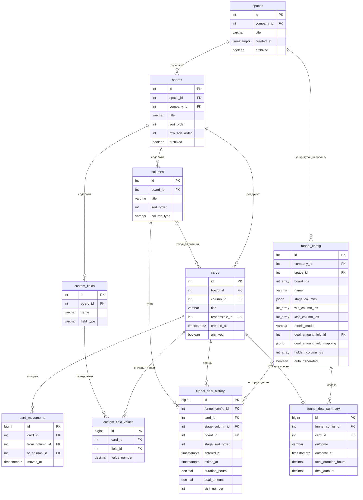

# Объединение нескольких досок в единую воронку (Multi-Board Unification)

## Контекст

### Проблема (P-005)

Текущая реализация строит отдельную воронку для каждой доски. CRM-процесс часто проходит через несколько досок (например, "Лиды" -> "Сделки" -> "Аккаунтинг"), и пользователь должен видеть единую сквозную воронку по всему пространству.

> _"Воронка одна на пространстве. Одна. Только конфигурация определяет последовательность этих [колонок]."_ -- Slava (CPO)

### Архитектурное решение

| Было | Стало |
|------|-------|
| `funnel_config.board_id` (одна доска) | `funnel_config.space_id` + `funnel_config.board_ids[]` (пространство, несколько досок) |
| Колонки одной доски = этапы | Колонки всех досок пространства = этапы |
| Карточки одной доски | Карточки всех досок в scope |

---

## 1. Алгоритм объединения колонок

### 1.1. Порядок досок на пространстве

Доски в пространстве Kaiten имеют двумерное расположение: строки (rows) и позиция внутри строки. Для линеаризации в одномерную последовательность используется порядок **сверху вниз, слева направо** -- тот же, что в кумулятивной диаграмме.

```sql
SELECT b.id, b.title, b.sort_order, b.row_sort_order
FROM boards b
WHERE b.space_id = :space_id
  AND b.archived = false
ORDER BY b.row_sort_order ASC, b.sort_order ASC;
```

**Пример:**

```
Пространство "CRM"
┌──────────────────────────────────────────────────────────┐
│  Строка 1:  [Доска "Лиды"]    [Доска "Квалификация"]    │
│  Строка 2:  [Доска "Сделки"]                             │
└──────────────────────────────────────────────────────────┘

Линеаризация: Лиды (1) -> Квалификация (2) -> Сделки (3)
```

### 1.2. Построение единой последовательности колонок

Колонки каждой доски берутся в порядке `sort_order` (слева направо). Доски объединяются последовательно. Колонки с `column_type = 'done'` исключаются из этапов и обрабатываются отдельно (см. best-guess-algorithm.md, Шаг 4).

**Псевдокод:**

```python
def build_unified_stages(boards, columns_by_board):
    """
    Объединяет колонки нескольких досок в единую последовательность этапов.

    Args:
        boards: отсортированный список досок (из Шага 1)
        columns_by_board: Dict[board_id, List[Column]]

    Returns:
        stages: List[UnifiedStage] -- этапы воронки
        done_columns: List[Column] -- done-колонки для won/lost
    """
    stages = []
    done_columns = []
    global_sort = 0

    for board in boards:
        board_cols = columns_by_board.get(board.id, [])
        for col in board_cols:
            if col.column_type == 'done':
                done_columns.append(col)
            else:
                global_sort += 1
                stages.append(UnifiedStage(
                    column_id=col.id,
                    board_id=board.id,
                    board_name=board.title,
                    label=col.title,
                    sort_order=global_sort,
                    original_sort_order=col.sort_order
                ))

    return stages, done_columns
```

### 1.3. Объединение одноимённых колонок

**Ключевой вопрос:** Если на доске "Лиды" есть колонка "В работе" и на доске "Сделки" тоже есть колонка "В работе" -- объединять ли их в один этап воронки?

**Решение: по умолчанию НЕ объединяем.**

Обоснование:
- Одноимённые колонки на разных досках -- это **разные этапы процесса**. "В работе" на доске "Лиды" (квалификация лида) и "В работе" на доске "Сделки" (работа по сделке) -- принципиально разные действия.
- Автоматическое объединение может привести к некорректным данным.
- По паттерну кумулятивной диаграммы: каждая колонка -- отдельная зона, даже если имена совпадают.

**Отображение в UI:** Для одноимённых колонок добавляется суффикс с названием доски.

```python
def resolve_label_conflicts(stages):
    """
    Если у нескольких этапов одинаковые label,
    добавляет суффикс с названием доски.
    """
    label_counts = Counter(s.label for s in stages)
    duplicated_labels = {l for l, c in label_counts.items() if c > 1}

    for stage in stages:
        if stage.label in duplicated_labels:
            stage.display_label = f"{stage.label} ({stage.board_name})"
        else:
            stage.display_label = stage.label

    return stages
```

**Пример:**

| Доска | Колонка | Этап воронки |
|-------|---------|--------------|
| Лиды | Новый | Новый |
| Лиды | В работе | В работе (Лиды) |
| Сделки | В работе | В работе (Сделки) |
| Сделки | Предложение | Предложение |

### 1.4. Nice to Have: ручное объединение колонок

В будущих итерациях пользователь может вручную объединить колонки через настройки:

```typescript
interface StageGroupConfig {
  /** Объединённое название этапа */
  label: string;
  /** Массив column_id, которые объединяются в один этап */
  column_ids: number[];
}
```

При объединении:
- Сделка считается "вошедшей на этап" при входе в любую из объединённых колонок
- Время на этапе считается суммарно по всем колонкам группы
- Конверсия считается по выходу из последней колонки группы

**Приоритет:** Nice to Have для будущих итераций. Для первого релиза -- каждая колонка = отдельный этап.

---

## 2. Обработка разных полей суммы на разных досках (P-007)

### 2.1. Описание проблемы

> _"Там миллионы, а там шкурки..."_ -- Din

На доске "Лиды" может быть поле "Оценка бюджета" (number), а на доске "Сделки" -- поле "Сумма контракта" (number). Суммировать их некорректно: разные поля имеют разный смысл и масштаб.

### 2.2. Алгоритм определения общего поля

Алгоритм определения числового поля для суммы описан подробно в `research/best-guess-algorithm.md`, раздел "Шаг 5: Определение поля суммы сделки". Здесь приводится спецификация поведения при каждом сценарии.

#### Сценарий A. Одинаковое поле на всех досках

**Условие:** На всех досках (где есть числовое поле) существует поле с одним и тем же именем (сравнение case-insensitive, trim).

**Поведение:**
- `metric_mode = 'amount'`
- Для карточки на доске X берётся значение поля с board_id = X
- Суммы корректно агрегируются через все этапы

```sql
-- Получение суммы сделки с учётом multi-board
SELECT cfv.value_number AS deal_amount
FROM custom_field_values cfv
JOIN custom_fields cf ON cfv.field_id = cf.id
WHERE cfv.card_id = :card_id
  AND cf.field_type = 'number'
  AND cf.board_id = (
    SELECT board_id FROM cards WHERE id = :card_id
  )
  AND lower(trim(cf.name)) = lower(trim(:common_field_name));
```

#### Сценарий B. Разные поля на разных досках

**Условие:** Имена числовых полей не совпадают между досками.

**Поведение:**
- `metric_mode = 'count'` (fallback)
- Алерт: `DIFFERENT_AMOUNT_FIELDS`
- Пользователь может в настройках указать маппинг: какое поле на какой доске считать "суммой"

**Структура маппинга в пользовательском конфиге:**

```typescript
interface AmountFieldMapping {
  /** Маппинг board_id -> field_id */
  board_field_map: Record<number, number>;
}
```

**Пример:**

```json
{
  "board_field_map": {
    "101": 501,
    "102": 602
  }
}
```

Где `101` -- board_id доски "Лиды", `501` -- field_id поля "Оценка бюджета"; `102` -- board_id доски "Сделки", `602` -- field_id поля "Сумма контракта".

**Когда маппинг задан пользователем:**
- `metric_mode = 'amount'`
- Для каждой карточки берётся значение из `board_field_map[card.board_id]`
- Предполагается, что пользователь подтвердил сопоставимость этих полей

#### Сценарий C. На части досок нет числового поля

**Условие:** На доске "Лиды" есть "Сумма", на доске "Квалификация" -- нет числовых полей.

**Поведение:**
- `metric_mode = 'count'` (fallback)
- Алерт: `PARTIAL_AMOUNT_FIELDS`
- Карточки с досок без поля суммы не имеют `deal_amount` -- не участвуют в денежных метриках

**Альтернатива (если пользователь задал маппинг):**
- Для досок без маппинга: `deal_amount = NULL`
- Метрики суммы считаются только по карточкам с заполненной суммой
- В UI отображается предупреждение: "N карточек без суммы"

#### Сценарий D. Нет числовых полей ни на одной доске

**Поведение:**
- `metric_mode = 'count'`
- Алерт: `NO_AMOUNT_FIELD`
- Все денежные метрики (сумма, средний чек, pipeline value, weighted pipeline, velocity) -- `null`
- Переключатель "Сумма" задизейблен

### 2.3. SQL: получение суммы с учётом multi-board

```sql
-- Для auto-config: одно общее имя поля
WITH amount_fields AS (
  SELECT cf.id AS field_id, cf.board_id, cf.name
  FROM custom_fields cf
  WHERE cf.board_id = ANY(:board_ids)
    AND cf.field_type = 'number'
    AND lower(trim(cf.name)) = lower(trim(:common_field_name))
)
SELECT
  c.id AS card_id,
  cfv.value_number AS deal_amount
FROM cards c
LEFT JOIN amount_fields af ON c.board_id = af.board_id
LEFT JOIN custom_field_values cfv
  ON cfv.card_id = c.id
  AND cfv.field_id = af.field_id
WHERE c.board_id = ANY(:board_ids);
```

```sql
-- Для пользовательского маппинга: board_field_map
-- Предполагаем, что маппинг передан как массив (board_id, field_id)
WITH field_map(board_id, field_id) AS (
  VALUES
    (101, 501),
    (102, 602)
)
SELECT
  c.id AS card_id,
  cfv.value_number AS deal_amount
FROM cards c
LEFT JOIN field_map fm ON c.board_id = fm.board_id
LEFT JOIN custom_field_values cfv
  ON cfv.card_id = c.id
  AND cfv.field_id = fm.field_id
WHERE c.board_id = ANY(:board_ids);
```

### 2.4. Поведение при конфликте (невозможно объединить)

Конфликт возникает, когда:
1. На досках разные числовые поля (Сценарий B) И
2. Пользователь не задал маппинг

**Поведение:**

```
metric_mode = 'count'
deal_amount = NULL для всех карточек

Алерт (warning):
"На разных досках используются разные числовые поля.
 Воронка построена по количеству карточек.
 Чтобы видеть суммы, настройте соответствие полей."
 [Кнопка: Настроить]
```

**Пользователь может:**
1. Принять fallback на count и работать с количеством карточек
2. Открыть настройки и задать маппинг `board_field_map`
3. Добавить одноимённое числовое поле на все доски (решение на уровне доски)

---

## 3. Поведение скрытых колонок (F-006, Nice to Have)

### 3.1. Контекст

> _"Если тебе колонки между x и x+1 просто скрыл, то у тебя должна не пропасть эта конверсия, а просуммироваться."_ -- Slava (CPO)

В кумулятивной диаграмме скрытая колонка исключается из графика. В воронке поведение другое: скрытие промежуточной колонки должно **суммировать** её данные с предыдущим этапом, а не исключать. Иначе теряется конверсия.

### 3.2. Правила суммирования

**Базовый принцип:** Скрытая колонка "схлопывается" в предыдущую видимую колонку.

**Пример:**

Исходная воронка: A -> B -> C -> D

Пользователь скрывает B:

```
Было:           A(50) -> B(40) -> C(30) -> D(20)
Стало:          A(50) ---------> C(30) -> D(20)

Конверсия A->C: 30/50 = 60% (вместо A->B = 40/50 = 80%)
```

**Что происходит с метриками скрытой колонки B:**

| Метрика | Поведение |
|---------|-----------|
| Количество сделок | Не включается в отображение, но используется для расчёта конверсий |
| Сумма сделок | Не отображается |
| Конверсия B->C | Не отображается; вместо неё -- конверсия A->C |
| Время на B | Суммируется со временем на A для карточек, прошедших через B |
| Зависшие на B | Показываются в подсказке к этапу A: "Включая N карточек на скрытом этапе B" |

### 3.3. Алгоритм суммирования

```python
def apply_hidden_columns(stages, hidden_column_ids):
    """
    Схлопывает скрытые колонки в предыдущие видимые.

    Returns:
        visible_stages: List[VisibleStage] -- видимые этапы
        merge_map: Dict[hidden_column_id, target_column_id] -- маппинг скрытых в видимые
    """
    visible_stages = []
    merge_map = {}  # hidden_column_id -> target_visible_column_id
    pending_hidden = []  # скрытые, ожидающие присоединения

    for stage in stages:
        if stage.column_id in hidden_column_ids:
            pending_hidden.append(stage)
        else:
            # Видимый этап: к нему присоединяются все предшествующие скрытые
            if pending_hidden and len(visible_stages) > 0:
                # Скрытые колонки перед текущей -- присоединяются к предыдущей видимой
                prev_visible = visible_stages[-1]
                for hidden in pending_hidden:
                    merge_map[hidden.column_id] = prev_visible.column_id
                    prev_visible.merged_column_ids.append(hidden.column_id)
                pending_hidden = []
            elif pending_hidden and len(visible_stages) == 0:
                # Скрытые в самом начале -- присоединятся к первому видимому
                for hidden in pending_hidden:
                    merge_map[hidden.column_id] = stage.column_id
                    stage.merged_column_ids = [hidden.column_id]
                pending_hidden = []

            visible_stages.append(stage)

    # Скрытые в конце -- присоединяются к последней видимой
    if pending_hidden and len(visible_stages) > 0:
        last_visible = visible_stages[-1]
        for hidden in pending_hidden:
            merge_map[hidden.column_id] = last_visible.column_id
            last_visible.merged_column_ids.append(hidden.column_id)

    return visible_stages, merge_map
```

### 3.4. SQL: агрегация с учётом скрытых колонок

```sql
-- merge_map передаётся как параметр: массив (hidden_column_id, target_column_id)
WITH merge_map(hidden_id, target_id) AS (
  VALUES
    (5002, 5001),  -- колонка B схлопнута в A
    (5005, 5004)   -- колонка E схлопнута в D
),

-- Маппинг column_id -> effective_column_id (с учётом скрытых)
effective_columns AS (
  SELECT
    COALESCE(mm.target_id, fdh.stage_column_id) AS effective_stage_id,
    fdh.*
  FROM funnel_deal_history fdh
  LEFT JOIN merge_map mm ON fdh.stage_column_id = mm.hidden_id
)

-- Агрегация по effective_stage_id
SELECT
  ec.effective_stage_id AS stage_column_id,
  COUNT(DISTINCT ec.card_id) AS deals_entered,
  SUM(ec.deal_amount) FILTER (WHERE ec.visit_number = 1) AS total_amount
FROM effective_columns ec
JOIN cohort c ON ec.card_id = c.card_id
WHERE ec.funnel_config_id = :funnel_config_id
GROUP BY ec.effective_stage_id;
```

### 3.5. Расчёт времени на этапе с учётом скрытых колонок

При схлопывании скрытого этапа B в видимый этап A время рассчитывается так:

```python
def calculate_merged_duration(card_id, visible_stage_id, merged_ids, deal_history):
    """
    Для карточки: суммирует время на видимом этапе и всех схлопнутых.
    """
    all_ids = [visible_stage_id] + merged_ids
    total_hours = 0

    for stage_id in all_ids:
        visits = deal_history.get_visits(card_id, stage_id)
        for visit in visits:
            if visit.duration_hours is not None:
                total_hours += visit.duration_hours

    return total_hours
```

### 3.6. Пример с числами

**Исходные данные:**

| Этап | Карточки | Сумма | Конверсия в след. | Avg время |
|------|----------|-------|-------------------|-----------|
| A | 100 | 10M | 80% (80 -> B) | 2 дня |
| B | 80 | 8M | 75% (60 -> C) | 3 дня |
| C | 60 | 7M | 67% (40 -> D) | 4 дня |
| D | 40 | 5M | -- | 5 дней |

**Пользователь скрыл B. Результат:**

| Этап | Карточки | Сумма | Конверсия в след. | Avg время | Примечание |
|------|----------|-------|-------------------|-----------|------------|
| A | 100 | 10M | 60% (60 -> C) | ~4 дня* | *Время A + время B для карточек, прошедших через B |
| C | 60 | 7M | 67% (40 -> D) | 4 дня | Без изменений |
| D | 40 | 5M | -- | 5 дней | Без изменений |

**Расчёт "Avg время" для A:**
- 80 карточек прошли A (2 дня) + B (3 дня) = 5 дней каждая
- 20 карточек были только на A (2 дня) -- они выпали на A, не дошли до B
- Средневзвешенное: (80 * 5 + 20 * 2) / 100 = 4.4 дня

**Конверсия A -> C:**
- Из 100 карточек, вошедших в A, 60 дошли до C
- Конверсия = 60 / 100 = 60%
- Это корректно отражает реальную проходимость через два этапа

---

## 4. Обновлённая модель данных

### 4.1. Изменения в `funnel_config`

```diff
  funnel_config
- board_id          integer    FK на доску                  NOT NULL
+ space_id          integer    FK на пространство           NOT NULL
+ board_ids         integer[]  Массив FK на доски           NOT NULL
+ metric_mode       varchar    'amount' | 'count'           NOT NULL DEFAULT 'count'
+ deal_amount_field_mapping  jsonb  Маппинг board_id->field_id  NULL
+ auto_generated    boolean    Сгенерирован автоматически   NOT NULL DEFAULT true
```

**Полная структура `funnel_config` (обновлённая):**

| Поле | Тип | Описание | Nullable | Пример |
|------|-----|----------|----------|--------|
| `id` | integer | PK | Нет | `1` |
| `company_id` | integer | FK на компанию | Нет | `7` |
| `space_id` | integer | FK на пространство | Нет | `42` |
| `board_ids` | integer[] | Массив ID досок, входящих в воронку | Нет | `[101, 102]` |
| `name` | varchar(255) | Название конфигурации | Нет | `Основная воронка` |
| `stage_columns` | jsonb | Этапы (теперь с board_id) | Нет | см. ниже |
| `win_column_ids` | integer[] | Колонки "Выигран" | Нет | `[5006]` |
| `loss_column_ids` | integer[] | Колонки "Проигран" | Нет | `[5007]` |
| `metric_mode` | varchar(20) | Режим метрики | Нет | `'amount'` |
| `deal_amount_field_id` | integer | FK на общее поле суммы (если одно) | Да | `201` |
| `deal_amount_field_mapping` | jsonb | Маппинг board->field (если разные) | Да | `{"101": 501, "102": 602}` |
| `deal_source_field_id` | integer | FK на поле источника | Да | `202` |
| `stage_probabilities` | jsonb | Вероятности по этапам | Да | `{"5001": 0.2}` |
| `hidden_column_ids` | integer[] | Скрытые колонки (Nice to Have) | Да | `[5002]` |
| `auto_generated` | boolean | Автоматически сгенерирован | Нет | `true` |
| `created_at` | timestamptz | Дата создания | Нет | `2024-03-20T12:00:00Z` |
| `updated_at` | timestamptz | Дата обновления | Нет | `2024-03-20T12:00:00Z` |
| `created_by_user_id` | integer | FK на создателя | Нет | `301` |

**Обновлённый формат `stage_columns`:**

```json
[
  {
    "column_id": 5001,
    "board_id": 101,
    "label": "Квалификация",
    "sort_order": 1,
    "stale_threshold_days": 7
  },
  {
    "column_id": 5002,
    "board_id": 101,
    "label": "Встреча",
    "sort_order": 2,
    "stale_threshold_days": 10
  },
  {
    "column_id": 6001,
    "board_id": 102,
    "label": "Предложение",
    "sort_order": 3,
    "stale_threshold_days": 14
  }
]
```

### 4.2. Новая исходная сущность: `spaces`

| Поле | Тип | Описание | Nullable | Пример |
|------|-----|----------|----------|--------|
| `id` | integer | PK | Нет | `42` |
| `company_id` | integer | FK на компанию | Нет | `7` |
| `title` | varchar(255) | Название пространства | Нет | `CRM` |
| `created_at` | timestamptz | Дата создания | Нет | `2024-01-10T08:00:00Z` |
| `archived` | boolean | Флаг архивации | Нет | `false` |

**Что нужно для отчёта:** `id`, `company_id`, `title`. Пространство -- корневая сущность для воронки. Все доски принадлежат пространству.

### 4.3. Обновление `boards`

Добавляется связь с пространством (если отсутствует):

| Поле | Тип | Описание | Nullable | Пример |
|------|-----|----------|----------|--------|
| `space_id` | integer | FK на пространство | Нет | `42` |
| `row_sort_order` | integer | Порядок строки в пространстве | Нет | `1` |

---

## 5. ER-диаграмма



---

## 6. SQL-примеры ключевых запросов

### 6.1. Получение единой последовательности этапов (multi-board)

```sql
-- Получить все этапы воронки из нескольких досок
-- с учётом порядка досок и колонок
WITH board_order AS (
  SELECT b.id AS board_id,
         b.title AS board_title,
         ROW_NUMBER() OVER (
           ORDER BY b.row_sort_order ASC, b.sort_order ASC
         ) AS board_position
  FROM boards b
  WHERE b.space_id = :space_id
    AND b.archived = false
)
SELECT
  c.id AS column_id,
  c.board_id,
  bo.board_title,
  c.title AS column_title,
  c.column_type,
  ROW_NUMBER() OVER (
    ORDER BY bo.board_position ASC, c.sort_order ASC
  ) AS global_sort_order
FROM columns c
JOIN board_order bo ON c.board_id = bo.board_id
WHERE c.column_type != 'done'
ORDER BY global_sort_order;
```

### 6.2. Кросс-board агрегация: количество сделок по этапам

```sql
-- Количество уникальных сделок на каждом этапе (multi-board)
-- cohort и filtered_cards определены ранее (см. calculation-spec.md)
WITH stage_config AS (
  SELECT
    (elem->>'column_id')::int AS column_id,
    (elem->>'board_id')::int AS board_id,
    (elem->>'sort_order')::int AS sort_order,
    elem->>'label' AS label
  FROM funnel_config fc,
       jsonb_array_elements(fc.stage_columns) AS elem
  WHERE fc.id = :funnel_config_id
)
SELECT
  sc.column_id,
  sc.board_id,
  sc.label,
  sc.sort_order,
  COUNT(DISTINCT fdh.card_id) AS deals_entered,
  SUM(fdh.deal_amount) FILTER (WHERE fdh.visit_number = 1) AS total_amount,
  COUNT(DISTINCT fdh.card_id) FILTER (
    WHERE fdh.deal_amount IS NOT NULL AND fdh.visit_number = 1
  ) AS deals_with_amount
FROM stage_config sc
LEFT JOIN funnel_deal_history fdh
  ON fdh.stage_column_id = sc.column_id
  AND fdh.funnel_config_id = :funnel_config_id
LEFT JOIN cohort c ON fdh.card_id = c.card_id
GROUP BY sc.column_id, sc.board_id, sc.label, sc.sort_order
ORDER BY sc.sort_order;
```

### 6.3. Построение funnel_deal_history (multi-board)

```sql
-- Построение истории сделок через воронку, spanning multiple boards
WITH config AS (
  SELECT
    fc.space_id,
    fc.board_ids,
    fc.stage_columns,
    fc.win_column_ids,
    fc.loss_column_ids,
    fc.deal_amount_field_id,
    fc.deal_amount_field_mapping
  FROM funnel_config fc
  WHERE fc.id = :funnel_config_id
),

stage_column_ids AS (
  SELECT
    (elem->>'column_id')::int AS column_id,
    (elem->>'board_id')::int AS board_id,
    (elem->>'sort_order')::int AS sort_order
  FROM config, jsonb_array_elements(config.stage_columns) AS elem
),

-- Все перемещения карточек ВСЕХ досок пространства
all_movements AS (
  SELECT
    cm.id,
    cm.card_id,
    cm.from_column_id,
    cm.to_column_id,
    cm.moved_at,
    c.board_id AS card_board_id,
    CASE
      WHEN cm.to_column_id IN (SELECT column_id FROM stage_column_ids) THEN 'stage'
      WHEN cm.to_column_id = ANY((SELECT win_column_ids FROM config)) THEN 'win'
      WHEN cm.to_column_id = ANY((SELECT loss_column_ids FROM config)) THEN 'loss'
      ELSE 'other'
    END AS to_type,
    sc.sort_order AS to_sort_order
  FROM card_movements cm
  JOIN cards c ON cm.card_id = c.id
  LEFT JOIN stage_column_ids sc ON cm.to_column_id = sc.column_id
  WHERE c.board_id = ANY((SELECT board_ids FROM config))
  ORDER BY cm.card_id, cm.moved_at, cm.id
),

-- Построение визитов на этапы
stage_entries AS (
  SELECT
    m.card_id,
    m.card_board_id,
    m.to_column_id AS stage_column_id,
    m.to_sort_order AS stage_sort_order,
    m.moved_at AS entered_at,
    LEAD(m.moved_at) OVER (
      PARTITION BY m.card_id ORDER BY m.moved_at, m.id
    ) AS exited_at,
    LEAD(m.to_column_id) OVER (
      PARTITION BY m.card_id ORDER BY m.moved_at, m.id
    ) AS next_column_id,
    ROW_NUMBER() OVER (
      PARTITION BY m.card_id, m.to_column_id
      ORDER BY m.moved_at
    ) AS visit_number
  FROM all_movements m
  WHERE m.to_type = 'stage'
)

SELECT
  :funnel_config_id AS funnel_config_id,
  se.card_id,
  se.card_board_id AS board_id,
  se.stage_column_id,
  se.stage_sort_order,
  se.entered_at,
  se.exited_at,
  se.next_column_id,
  EXTRACT(EPOCH FROM se.exited_at - se.entered_at) / 3600.0 AS duration_hours,
  se.visit_number,
  -- Сумма сделки: из маппинга или общего поля
  COALESCE(
    -- Маппинг по board_id
    (SELECT cfv.value_number
     FROM custom_field_values cfv
     WHERE cfv.card_id = se.card_id
       AND cfv.field_id = (
         (SELECT deal_amount_field_mapping FROM config)
         ->> se.card_board_id::text
       )::int
    ),
    -- Общее поле
    (SELECT cfv.value_number
     FROM custom_field_values cfv
     WHERE cfv.card_id = se.card_id
       AND cfv.field_id = (SELECT deal_amount_field_id FROM config)
    )
  ) AS deal_amount
FROM stage_entries se;
```

### 6.4. Фильтрация карточек (multi-board)

```sql
-- Обновлённый filtered_cards для multi-board
WITH filtered_cards AS (
  SELECT c.id AS card_id
  FROM cards c
  WHERE c.board_id = ANY(:board_ids)
    AND (c.archived = false OR :include_archived = true)
    AND (:responsible_ids IS NULL OR c.responsible_id = ANY(:responsible_ids))
    -- Фильтр по сумме: учитываем маппинг полей
    AND (
      :amount_min IS NULL
      OR EXISTS (
        SELECT 1
        FROM custom_field_values cfv
        WHERE cfv.card_id = c.id
          AND cfv.field_id = COALESCE(
            -- Маппинг
            (:deal_amount_field_mapping ->> c.board_id::text)::int,
            -- Общее поле
            :deal_amount_field_id
          )
          AND cfv.value_number >= :amount_min
      )
    )
    AND (
      :amount_max IS NULL
      OR EXISTS (
        SELECT 1
        FROM custom_field_values cfv
        WHERE cfv.card_id = c.id
          AND cfv.field_id = COALESCE(
            (:deal_amount_field_mapping ->> c.board_id::text)::int,
            :deal_amount_field_id
          )
          AND cfv.value_number <= :amount_max
      )
    )
    AND (
      :source_values IS NULL
      OR EXISTS (
        SELECT 1 FROM custom_field_values cfv
        WHERE cfv.card_id = c.id
          AND cfv.field_id = :deal_source_field_id
          AND (cfv.value_text = ANY(:source_values)
               OR cfv.value_select = ANY(:source_values))
      )
    )
    AND (
      :tag_names IS NULL
      OR EXISTS (
        SELECT 1 FROM tags t
        WHERE t.card_id = c.id AND t.name = ANY(:tag_names)
      )
    )
)
```

### 6.5. Когорта периода (multi-board)

```sql
-- Когорта: сделки, впервые вошедшие в воронку в пределах периода
-- Без изменений в логике, но funnel_deal_history теперь содержит
-- записи с карточками из разных досок
WITH cohort AS (
  SELECT fdh.card_id, MIN(fdh.entered_at) AS first_entered_at
  FROM funnel_deal_history fdh
  JOIN filtered_cards fc ON fdh.card_id = fc.card_id
  WHERE fdh.funnel_config_id = :funnel_config_id
  GROUP BY fdh.card_id
  HAVING MIN(fdh.entered_at) >= :date_from
     AND MIN(fdh.entered_at) < :date_to + INTERVAL '1 day'
)
```

---

## 7. Индексы для multi-board запросов

### Новые/обновлённые индексы

| Таблица | Индекс | Назначение |
|---------|--------|------------|
| `boards` | `(space_id, archived)` | Получение досок пространства |
| `boards` | `(space_id, row_sort_order, sort_order)` | Сортировка досок |
| `cards` | `(board_id) WHERE board_id = ANY(...)` | Фильтрация по нескольким доскам |
| `card_movements` | `(card_id, moved_at, id)` | Построение истории с tiebreaker |
| `custom_fields` | `(board_id, field_type)` | Поиск числовых полей по доскам |
| `funnel_config` | `(space_id, company_id)` | Поиск конфига по пространству |
| `funnel_deal_history` | `(funnel_config_id, stage_column_id, entered_at)` | Агрегация по этапу |
| `funnel_deal_history` | `(funnel_config_id, card_id, entered_at)` | История сделки |
| `funnel_deal_history` | `(funnel_config_id, board_id)` | Фильтрация по доске внутри воронки |

### Комментарии по производительности

- **Multi-board увеличивает объём данных** в `funnel_deal_history` пропорционально количеству досок. Для пространства с 5 досками объём вырастает в ~5x по сравнению с single-board.
- **Индекс `(board_id) WHERE board_id = ANY(...)`** -- PostgreSQL эффективно использует `= ANY()` с индексом по `board_id`, если массив небольшой (до 20 элементов).
- **Рекомендация:** При > 100 000 записей в `card_movements` по пространству -- использовать материализацию `funnel_deal_history` с инкрементальным обновлением.

---

## 8. Миграция с single-board на multi-board

### Обратная совместимость

Существующие конфигурации с `board_id` мигрируют по правилу:

```sql
-- Миграция: board_id -> space_id + board_ids
UPDATE funnel_config fc
SET
  space_id = b.space_id,
  board_ids = ARRAY[fc.board_id],
  metric_mode = CASE
    WHEN fc.deal_amount_field_id IS NOT NULL THEN 'amount'
    ELSE 'count'
  END,
  auto_generated = false
FROM boards b
WHERE b.id = fc.board_id;

-- Удаление board_id после миграции
ALTER TABLE funnel_config DROP COLUMN board_id;
```

### Переходный период

1. API принимает как `space_id`, так и `board_id` (deprecated)
2. Если передан `board_id` -- автоматически конвертируется в `space_id` с `board_ids = [board_id]`
3. Через 2 релиза `board_id` убирается из API
