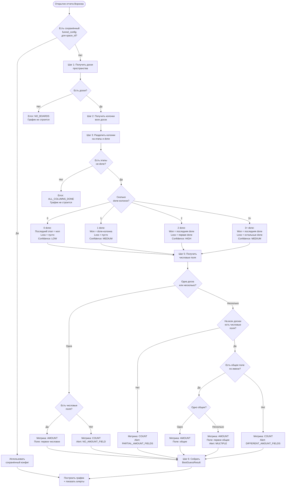

# Алгоритм Best Guess: автоконфигурация воронки продаж

## Контекст и мотивация

### Проблема (P-001, P-002, P-003)

Текущая реализация воронки требует ручной настройки перед отображением графика. Пользователь видит «стоп-экран» и не может получить результат без двухуровневой конфигурации: выбор доски + настройка колонок. Это нарушает паттерн Kaiten, где все графики строятся сразу.

> _"Работать должно на Best Guess, потому что все остальные графики работают на Best Guess и работают."_ -- Slava (CPO)

### Целевое поведение

При открытии отчёта "Воронка продаж" график **строится немедленно** на основе автоматически определённой конфигурации. Пользователь видит результат и при необходимости корректирует настройки.

### Референс: кумулятивная диаграмма Kaiten

Кумулятивная диаграмма уже реализует подход Best Guess:
- Берёт все доски пространства в порядке расположения (слева направо, сверху вниз)
- Все колонки включены по умолчанию
- Зоны (группировки колонок) определяются автоматически по `column_type`
- Пользователь может перенастроить через фильтры, но график **уже отображается**

Воронка должна следовать этому же паттерну с поправкой на специфику CRM-сценария.

---

## Алгоритм автоконфигурации

### Обзор

Алгоритм принимает на вход `space_id` и возвращает готовую конфигурацию воронки: последовательность этапов, колонки won/lost, режим метрики (сумма или количество), а также набор предупреждений (алертов) для пользователя.

### Входные данные

| Параметр | Тип | Источник | Описание |
|----------|-----|----------|----------|
| `space_id` | integer | URL / контекст навигации | ID пространства, для которого строим воронку |
| `company_id` | integer | Сессия пользователя | ID компании (мультитенантность) |

### Выходные данные

```typescript
interface BestGuessResult {
  /** Конфигурация воронки */
  config: AutoFunnelConfig;

  /** Алерты для пользователя */
  alerts: BestGuessAlert[];

  /** Уровень уверенности алгоритма */
  confidence: 'high' | 'medium' | 'low';

  /** Режим метрики */
  metric_mode: 'amount' | 'count';

  /** Причина выбора metric_mode */
  metric_mode_reason: string;
}

interface AutoFunnelConfig {
  space_id: number;
  board_ids: number[];
  stages: AutoStage[];
  win_column_ids: number[];
  loss_column_ids: number[];
  deal_amount_field_id: number | null;
  auto_generated: true;
}

interface AutoStage {
  column_id: number;
  board_id: number;
  label: string;
  sort_order: number;
}

interface BestGuessAlert {
  type: 'info' | 'warning';
  code: string;
  message: string;
  action_label: string;
  action_target: 'settings';
}
```

---

### Пошаговый алгоритм

#### Шаг 1. Сбор досок пространства

Получить все неархивные доски пространства, отсортированные по порядку расположения: сверху вниз, слева направо (как в кумулятивной диаграмме).

```sql
SELECT b.id, b.title, b.sort_order, b.row_sort_order
FROM boards b
WHERE b.space_id = :space_id
  AND b.archived = false
ORDER BY b.row_sort_order ASC, b.sort_order ASC;
```

**Результат:** `boards[]` -- упорядоченный массив досок.

**Краевой кейс:** Если в пространстве 0 досок -- невозможно построить воронку. Возвращаем пустой результат с алертом `NO_BOARDS`.

---

#### Шаг 2. Сбор колонок всех досок

Для каждой доски получить колонки, отсортированные по `sort_order`.

```sql
SELECT c.id, c.board_id, c.title, c.sort_order, c.column_type
FROM columns c
WHERE c.board_id = ANY(:board_ids)
ORDER BY c.board_id, c.sort_order ASC;
```

**Результат:** `columns_by_board: Map<board_id, Column[]>` -- колонки, сгруппированные по доскам, в порядке слева направо.

---

#### Шаг 3. Построение единой последовательности этапов

Колонки всех досок объединяются в единую последовательность этапов воронки. Порядок: доска 1 (все колонки) -> доска 2 (все колонки) -> ... -> доска N.

**Важно:** Из этапов исключаются колонки с `column_type = 'done'`. Они будут кандидатами для won/lost (см. Шаг 4).

```
stages = []
global_sort_order = 0
for board in boards (в порядке из Шага 1):
    for column in columns_by_board[board.id]:
        if column.column_type != 'done':
            global_sort_order += 1
            stages.append({
                column_id: column.id,
                board_id: board.id,
                label: column.title,
                sort_order: global_sort_order
            })
```

**Результат:** `stages[]` -- единая последовательность этапов воронки.

**Краевой кейс:** Если после исключения `done`-колонок не осталось ни одного этапа -- все колонки являются `done`. Возвращаем алерт `ALL_COLUMNS_DONE`.

---

#### Шаг 4. Определение won/lost колонок

**Правило:** Колонки с `column_type = 'done'` являются кандидатами на терминальные (won/lost).

```
done_columns = все колонки всех досок, где column_type = 'done'
```

**Стратегия назначения:**

| Количество done-колонок | Действие | Уверенность |
|-------------------------|----------|-------------|
| 0 | won = последняя колонка последней доски (исключить из stages); loss = [] | `low` |
| 1 | won = эта колонка; loss = [] | `medium` |
| 2 | won = последняя done-колонка по sort_order; loss = остальные done | `high` |
| 3+ | won = последняя done-колонка по sort_order; loss = остальные done | `medium` |

**Псевдокод:**

```python
def determine_won_lost(done_columns, stages):
    if len(done_columns) == 0:
        # Нет done-колонок: последний этап = win, loss пустой
        last_stage = stages.pop()  # убираем из этапов
        return {
            'win': [last_stage.column_id],
            'loss': [],
            'confidence': 'low',
            'alerts': [ALERT_NO_DONE_COLUMNS]
        }

    if len(done_columns) == 1:
        return {
            'win': [done_columns[0].id],
            'loss': [],
            'confidence': 'medium',
            'alerts': [ALERT_SINGLE_DONE_COLUMN]
        }

    if len(done_columns) == 2:
        # Сортируем по порядку: последняя = won, первая = lost
        sorted_done = sort_by_global_position(done_columns)
        return {
            'win': [sorted_done[-1].id],
            'loss': [sorted_done[0].id],
            'confidence': 'high',
            'alerts': []
        }

    # 3+ done-колонок
    sorted_done = sort_by_global_position(done_columns)
    return {
        'win': [sorted_done[-1].id],
        'loss': [d.id for d in sorted_done[:-1]],
        'confidence': 'medium',
        'alerts': [ALERT_MULTIPLE_DONE_COLUMNS]
    }
```

**Функция `sort_by_global_position`:** Сортирует done-колонки по их глобальной позиции: сначала по порядку доски (из Шага 1), потом по `sort_order` внутри доски.

---

#### Шаг 5. Определение поля суммы сделки

Для каждой доски ищем числовые кастомные поля. Затем пытаемся найти общее поле.

```sql
SELECT cf.id, cf.name, cf.board_id, cf.field_type
FROM custom_fields cf
WHERE cf.board_id = ANY(:board_ids)
  AND cf.field_type = 'number'
ORDER BY cf.board_id, cf.id;
```

**Стратегия выбора:**

```python
def determine_amount_field(boards, number_fields_by_board):
    # Шаг 5a: Собираем числовые поля по каждой доске
    all_field_sets = {}
    for board_id in boards:
        all_field_sets[board_id] = number_fields_by_board.get(board_id, [])

    # Шаг 5b: Ищем поля с одинаковым именем на всех досках
    common_fields = find_common_field_names(all_field_sets)

    if len(common_fields) == 1:
        # Одно общее числовое поле на всех досках
        return {
            'field_id': common_fields[0].id,
            'metric_mode': 'amount',
            'reason': 'single_common_field',
            'alerts': []
        }

    if len(common_fields) > 1:
        # Несколько общих полей -- берём первое, алертим
        return {
            'field_id': common_fields[0].id,
            'metric_mode': 'amount',
            'reason': 'first_common_field',
            'alerts': [ALERT_MULTIPLE_AMOUNT_FIELDS]
        }

    if len(common_fields) == 0:
        # Нет общего поля
        boards_with_fields = [b for b in boards if all_field_sets[b]]
        boards_without_fields = [b for b in boards if not all_field_sets[b]]

        if len(boards_with_fields) == 0:
            # Нет числовых полей нигде
            return {
                'field_id': None,
                'metric_mode': 'count',
                'reason': 'no_number_fields',
                'alerts': [ALERT_NO_AMOUNT_FIELD]
            }

        if len(boards) == 1 and len(all_field_sets[boards[0]]) >= 1:
            # Одна доска, есть числовое поле -- берём первое
            return {
                'field_id': all_field_sets[boards[0]][0].id,
                'metric_mode': 'amount',
                'reason': 'single_board_first_field',
                'alerts': []
            }

        # Несколько досок, разные поля на разных досках
        return {
            'field_id': None,
            'metric_mode': 'count',
            'reason': 'incompatible_fields_across_boards',
            'alerts': [ALERT_DIFFERENT_AMOUNT_FIELDS]
        }
```

**Функция `find_common_field_names`:** Ищет числовые поля, имена которых совпадают на всех досках, где есть хотя бы одно числовое поле. Сравнение регистронезависимое, с trim.

---

#### Шаг 6. Сборка результата

```python
def best_guess(space_id, company_id):
    # Шаг 1
    boards = get_space_boards(space_id)
    if not boards:
        return error_result('NO_BOARDS')

    # Шаг 2
    columns_by_board = get_columns(boards)

    # Шаг 3
    stages = build_stages(boards, columns_by_board)
    if not stages:
        return error_result('ALL_COLUMNS_DONE')

    # Шаг 4
    done_columns = collect_done_columns(columns_by_board)
    won_lost = determine_won_lost(done_columns, stages)

    # Шаг 5
    amount = determine_amount_field(boards, get_number_fields(boards))

    # Шаг 6: сборка
    alerts = won_lost['alerts'] + amount['alerts']
    confidence = min_confidence(won_lost['confidence'], amount.get('confidence', 'high'))

    return BestGuessResult(
        config=AutoFunnelConfig(
            space_id=space_id,
            board_ids=[b.id for b in boards],
            stages=stages,
            win_column_ids=won_lost['win'],
            loss_column_ids=won_lost['loss'],
            deal_amount_field_id=amount['field_id'],
            auto_generated=True
        ),
        alerts=alerts,
        confidence=confidence,
        metric_mode=amount['metric_mode'],
        metric_mode_reason=amount['reason']
    )
```

---

## Матрица краевых кейсов

### Ось 1: Количество досок x Наличие суммы

| | 1 доска | N досок, одинаковое поле суммы | N досок, разные поля суммы | N досок, на части нет поля суммы |
|---|---|---|---|---|
| **Сумма есть** | Строим по сумме. Уверенность: high | Строим по сумме (общее поле). Уверенность: high | Fallback на count. Алерт DIFFERENT_AMOUNT_FIELDS | Fallback на count. Алерт PARTIAL_AMOUNT_FIELDS |
| **Суммы нет** | Строим по count. Алерт NO_AMOUNT_FIELD | Строим по count. Алерт NO_AMOUNT_FIELD | N/A | N/A |

### Ось 2: Количество done-колонок

| Количество done | 1 доска | N досок |
|---|---|---|
| **0** | Последняя колонка = won. Алерт. Confidence: low | Последняя колонка последней доски = won. Алерт. Confidence: low |
| **1** | Won = done-колонка, loss = []. Алерт SINGLE_DONE. Confidence: medium | Won = done-колонка, loss = []. Алерт SINGLE_DONE. Confidence: medium |
| **2** | Won = последняя done, loss = первая done. Confidence: high | Won = последняя done по глобальному порядку, loss = первая. Confidence: high |
| **3+** | Won = последняя done, loss = все остальные done. Алерт MULTIPLE_DONE. Confidence: medium | Аналогично. Алерт MULTIPLE_DONE. Confidence: medium |

### Ось 3: Полная матрица решений

| # | Досок | Done-колонок | Числовое поле | Решение | Метрика | Confidence | Алерты |
|---|-------|-------------|---------------|---------|---------|------------|--------|
| 1 | 1 | 2 | 1 поле | Идеальный кейс | amount | high | -- |
| 2 | 1 | 2 | 0 полей | Воронка по count | count | high | NO_AMOUNT_FIELD |
| 3 | 1 | 1 | 1 поле | Won без loss | amount | medium | SINGLE_DONE |
| 4 | 1 | 0 | 1 поле | Последняя колонка = won | amount | low | NO_DONE_COLUMNS |
| 5 | 1 | 3+ | 1 поле | Won = последняя done | amount | medium | MULTIPLE_DONE |
| 6 | N | 2 | Общее поле | Идеальный multi-board | amount | high | -- |
| 7 | N | 2 | Разные поля | Fallback на count | count | medium | DIFFERENT_AMOUNT_FIELDS |
| 8 | N | 2 | Частично есть | Fallback на count | count | medium | PARTIAL_AMOUNT_FIELDS |
| 9 | N | 0 | Общее поле | Последняя = won | amount | low | NO_DONE_COLUMNS |
| 10 | N | 1 | Нет полей | Минимальная воронка | count | low | SINGLE_DONE + NO_AMOUNT_FIELD |

---

## Условия показа алертов (F-002)

### Каталог алертов

| Код | Тип | Сообщение | Действие | Когда показывается |
|-----|-----|-----------|----------|--------------------|
| `NO_BOARDS` | error | На этом пространстве нет досок. Создайте доску, чтобы построить воронку. | -- | 0 досок в пространстве |
| `ALL_COLUMNS_DONE` | error | Все колонки на досках имеют тип "Готово". Добавьте колонки с другими типами для построения этапов воронки. | -- | Все колонки = done |
| `NO_DONE_COLUMNS` | warning | На досках нет колонок с типом "Готово". Мы использовали последнюю колонку как этап "Выигран". Настройте типы колонок для более точного результата. | Перейти в настройки | 0 done-колонок |
| `SINGLE_DONE_COLUMN` | info | Найдена одна завершающая колонка. Она используется как "Выигран". Если у вас есть отдельная колонка для проигранных сделок, укажите её в настройках. | Настроить | 1 done-колонка |
| `MULTIPLE_DONE_COLUMNS` | warning | Найдено несколько завершающих колонок. Мы определили последнюю как "Выигран", остальные как "Проигран". Проверьте, правильно ли это для вашего процесса. | Настроить | 3+ done-колонок |
| `NO_AMOUNT_FIELD` | info | На досках нет числового поля для суммы сделки. Воронка построена по количеству карточек. Добавьте числовое поле на доску, чтобы видеть суммы. | Перейти к доске | 0 числовых полей |
| `DIFFERENT_AMOUNT_FIELDS` | warning | На разных досках используются разные числовые поля. Воронка построена по количеству карточек, так как суммы несопоставимы. Настройте на досках одно общее поле суммы. | Как настроить сумму | Разные поля на разных досках |
| `PARTIAL_AMOUNT_FIELDS` | warning | Не на всех досках есть числовое поле. Воронка построена по количеству карточек. Настройте одинаковое поле суммы на всех досках. | Как настроить сумму | На части досок нет числового поля |
| `MULTIPLE_AMOUNT_FIELDS` | info | Найдено несколько общих числовых полей. Воронка построена по количеству карточек, пока на досках не останется одно общее поле суммы. | Как настроить сумму | >1 общих числовых полей |

### Правила показа

1. **Алерты типа `error`** блокируют отображение графика. Вместо графика -- сообщение.
2. **Алерты типа `warning`** отображаются над графиком. График строится.
3. **Алерты типа `info`** отображаются в сворачиваемом блоке над графиком. График строится.
4. **Не более 2 алертов одновременно.** Если больше -- показываем 2 самых приоритетных (error > warning > info). Остальные доступны по ссылке "ещё N".
5. **Алерт скрывается**, когда пользователь нажал "Настроить" и сохранил конфигурацию. После сохранения вместо auto-config используется пользовательская конфигурация.
6. **Алерт НЕ показывается повторно** для одного пространства в рамках сессии, если пользователь его закрыл (dismiss). При следующем открытии отчёта -- показывается снова.

### Логика приоритизации алертов

```python
ALERT_PRIORITY = {
    'NO_BOARDS': 1,          # error -- блокер
    'ALL_COLUMNS_DONE': 2,   # error -- блокер
    'NO_DONE_COLUMNS': 3,    # warning -- высокий
    'DIFFERENT_AMOUNT_FIELDS': 4,  # warning
    'PARTIAL_AMOUNT_FIELDS': 5,    # warning
    'MULTIPLE_DONE_COLUMNS': 6,    # warning
    'SINGLE_DONE_COLUMN': 7,       # info
    'NO_AMOUNT_FIELD': 8,          # info
    'MULTIPLE_AMOUNT_FIELDS': 9,   # info
}

def select_visible_alerts(alerts, max_visible=2):
    sorted_alerts = sorted(alerts, key=lambda a: ALERT_PRIORITY[a.code])
    visible = sorted_alerts[:max_visible]
    hidden = sorted_alerts[max_visible:]
    return visible, hidden
```

---

## Логика fallback на количество карточек (F-004)

### Принцип

Воронка **всегда** отображает данные. Если невозможно показать суммы -- показываем количество карточек. Пользователь видит результат и может потом настроить поле суммы.

### Когда `metric_mode = 'count'`

| Условие | Причина |
|---------|---------|
| Нет числовых полей ни на одной доске | `no_number_fields` |
| Разные числовые поля на разных досках, общего поля нет | `incompatible_fields_across_boards` |
| На части досок нет числового поля | `partial_fields` |
| Пользователь явно выбрал "Количество" в переключателе | `user_choice` |

### Когда `metric_mode = 'amount'`

| Условие | Причина |
|---------|---------|
| Одно общее числовое поле на всех досках | `single_common_field` |
| Одна доска с хотя бы одним числовым полем | `single_board_first_field` |
| Несколько общих полей (берём первое) | `first_common_field` |
| Пользователь явно выбрал поле в настройках | `user_choice` |

### Различия в расчётах между режимами

| Метрика | `amount` | `count` |
|---------|----------|---------|
| Значение этапа (основная цифра) | SUM(deal_amount) | COUNT(DISTINCT card_id) |
| Средний чек | SUM(deal_amount) / COUNT(cards_with_amount) | Не отображается |
| Pipeline value | SUM(deal_amount) | COUNT(DISTINCT card_id) на этапах |
| Weighted pipeline | SUM(deal_amount * probability) | Не отображается |
| Velocity | deals * win_rate * avg_size / cycle | Не отображается |
| Конверсия | Без изменений (всегда по количеству сделок) | Без изменений |
| Время на этапе | Без изменений | Без изменений |

### Переключатель "Количество / Сумма"

В UI отчёта доступен переключатель (toggle):
- **Количество** -- всегда доступен
- **Сумма** -- доступен только если `deal_amount_field_id IS NOT NULL`

Если `metric_mode = 'count'` по причине fallback, переключатель "Сумма" задизейблен с тултипом: "Настройте числовое поле для суммы сделки".

---

## Переход от auto-config к пользовательской конфигурации

### Жизненный цикл конфигурации

```
Первое открытие отчёта
        |
        v
  Best Guess алгоритм
        |
        v
  auto_generated = true
  (конфиг НЕ сохраняется в БД)
        |
        +-- Пользователь доволен? --> Работает на auto-config
        |
        +-- Пользователь нажал "Настроить"
                |
                v
          Открывается панель настроек
          (предзаполнена результатами Best Guess)
                |
                v
          Пользователь корректирует
                |
                v
          Нажимает "Сохранить"
                |
                v
          funnel_config сохраняется в БД
          auto_generated = false
                |
                v
          Все последующие открытия используют
          сохранённый конфиг
```

### Правила

1. **Auto-config не сохраняется в БД.** Вычисляется на лету при каждом открытии отчёта без сохранённого конфига.
2. **Сохранённый конфиг имеет приоритет.** Если `funnel_config` с `space_id` существует -- используется он, Best Guess не запускается.
3. **Удаление конфига возвращает к Best Guess.** Пользователь может удалить свою конфигурацию, после чего снова работает автоопределение.
4. **При изменении структуры досок** (добавление/удаление колонок, изменение `column_type`) auto-config пересчитывается автоматически. Сохранённый пользовательский конфиг НЕ пересчитывается -- пользователь получает предупреждение, если конфиг стал неконсистентным.

---

## Полный псевдокод алгоритма

```python
def best_guess_auto_config(space_id: int, company_id: int) -> BestGuessResult:
    """
    Главная функция Best Guess.
    Возвращает готовую конфигурацию воронки или ошибку.
    """
    alerts = []

    # ========================================
    # ШАГ 1: Сбор досок пространства
    # ========================================
    boards = db.query("""
        SELECT id, title, sort_order, row_sort_order
        FROM boards
        WHERE space_id = :space_id
          AND company_id = :company_id
          AND archived = false
        ORDER BY row_sort_order ASC, sort_order ASC
    """, space_id=space_id, company_id=company_id)

    if len(boards) == 0:
        return BestGuessResult(
            config=None,
            alerts=[Alert('error', 'NO_BOARDS', ...)],
            confidence='low',
            metric_mode='count',
            metric_mode_reason='no_boards'
        )

    board_ids = [b.id for b in boards]

    # ========================================
    # ШАГ 2: Сбор колонок
    # ========================================
    all_columns = db.query("""
        SELECT id, board_id, title, sort_order, column_type
        FROM columns
        WHERE board_id = ANY(:board_ids)
        ORDER BY board_id, sort_order ASC
    """, board_ids=board_ids)

    columns_by_board = group_by(all_columns, key='board_id')

    # ========================================
    # ШАГ 3: Разделение на этапы и done-колонки
    # ========================================
    stages = []
    done_columns = []
    global_sort = 0

    for board in boards:
        board_columns = columns_by_board.get(board.id, [])
        for col in board_columns:
            if col.column_type == 'done':
                done_columns.append(col)
            else:
                global_sort += 1
                stages.append(AutoStage(
                    column_id=col.id,
                    board_id=board.id,
                    label=col.title,
                    sort_order=global_sort
                ))

    if len(stages) == 0:
        return BestGuessResult(
            config=None,
            alerts=[Alert('error', 'ALL_COLUMNS_DONE', ...)],
            confidence='low',
            metric_mode='count',
            metric_mode_reason='no_stages'
        )

    # ========================================
    # ШАГ 4: Определение won/lost
    # ========================================
    won_ids = []
    loss_ids = []
    confidence = 'high'

    if len(done_columns) == 0:
        # Нет done-колонок -- последний этап = won
        last_stage = stages.pop()
        won_ids = [last_stage.column_id]
        loss_ids = []
        confidence = 'low'
        alerts.append(Alert('warning', 'NO_DONE_COLUMNS',
            'На досках нет колонок с типом "Готово". '
            'Последняя колонка используется как "Выигран".',
            'Настроить'))

    elif len(done_columns) == 1:
        won_ids = [done_columns[0].id]
        loss_ids = []
        confidence = 'medium'
        alerts.append(Alert('info', 'SINGLE_DONE_COLUMN',
            'Найдена одна завершающая колонка — "{name}". '
            'Она используется как "Выигран". Если нужна колонка '
            '"Проигран", укажите её в настройках.'.format(
                name=done_columns[0].title),
            'Настроить'))

    elif len(done_columns) == 2:
        # Сортируем по глобальной позиции
        sorted_done = sort_done_by_global_position(done_columns, boards)
        won_ids = [sorted_done[-1].id]
        loss_ids = [sorted_done[0].id]
        confidence = 'high'

    else:  # 3+
        sorted_done = sort_done_by_global_position(done_columns, boards)
        won_ids = [sorted_done[-1].id]
        loss_ids = [d.id for d in sorted_done[:-1]]
        confidence = 'medium'
        alerts.append(Alert('warning', 'MULTIPLE_DONE_COLUMNS',
            'Найдено {n} завершающих колонок. Последняя ("{won}") '
            'определена как "Выигран", остальные — как "Проигран". '
            'Проверьте настройки.'.format(
                n=len(done_columns),
                won=sorted_done[-1].title),
            'Настроить'))

    # ========================================
    # ШАГ 5: Определение поля суммы
    # ========================================
    number_fields = db.query("""
        SELECT id, name, board_id
        FROM custom_fields
        WHERE board_id = ANY(:board_ids)
          AND field_type = 'number'
        ORDER BY board_id, id
    """, board_ids=board_ids)

    fields_by_board = group_by(number_fields, key='board_id')
    amount_result = determine_amount_field(board_ids, fields_by_board)

    deal_amount_field_id = amount_result['field_id']
    metric_mode = amount_result['metric_mode']
    alerts.extend(amount_result['alerts'])

    if amount_result.get('confidence') == 'low':
        confidence = 'low'
    elif amount_result.get('confidence') == 'medium' and confidence == 'high':
        confidence = 'medium'

    # ========================================
    # ШАГ 6: Сборка результата
    # ========================================
    config = AutoFunnelConfig(
        space_id=space_id,
        board_ids=board_ids,
        stages=stages,
        win_column_ids=won_ids,
        loss_column_ids=loss_ids,
        deal_amount_field_id=deal_amount_field_id,
        auto_generated=True
    )

    return BestGuessResult(
        config=config,
        alerts=alerts,
        confidence=confidence,
        metric_mode=metric_mode,
        metric_mode_reason=amount_result['reason']
    )


def determine_amount_field(board_ids, fields_by_board):
    """
    Определяет общее числовое поле для суммы сделки.
    """
    if len(board_ids) == 1:
        board_id = board_ids[0]
        fields = fields_by_board.get(board_id, [])
        if len(fields) == 0:
            return {
                'field_id': None,
                'metric_mode': 'count',
                'reason': 'no_number_fields',
                'confidence': 'high',
                'alerts': [Alert('info', 'NO_AMOUNT_FIELD', ...)]
            }
        return {
            'field_id': fields[0].id,
            'metric_mode': 'amount',
            'reason': 'single_board_first_field',
            'confidence': 'high',
            'alerts': (
                [Alert('info', 'MULTIPLE_AMOUNT_FIELDS', ...)]
                if len(fields) > 1 else []
            )
        }

    # Несколько досок: ищем общее поле по имени
    boards_with_fields = [b for b in board_ids if fields_by_board.get(b)]
    boards_without_fields = [b for b in board_ids if not fields_by_board.get(b)]

    if len(boards_with_fields) == 0:
        return {
            'field_id': None,
            'metric_mode': 'count',
            'reason': 'no_number_fields',
            'confidence': 'high',
            'alerts': [Alert('info', 'NO_AMOUNT_FIELD', ...)]
        }

    if len(boards_without_fields) > 0:
        # На части досок нет числовых полей
        return {
            'field_id': None,
            'metric_mode': 'count',
            'reason': 'partial_fields',
            'confidence': 'medium',
            'alerts': [Alert('warning', 'PARTIAL_AMOUNT_FIELDS', ...)]
        }

    # На всех досках есть числовые поля -- ищем общее имя
    field_names_per_board = {
        b: {normalize(f.name) for f in fields_by_board[b]}
        for b in boards_with_fields
    }
    common_names = set.intersection(*field_names_per_board.values())

    if len(common_names) == 0:
        return {
            'field_id': None,
            'metric_mode': 'count',
            'reason': 'incompatible_fields_across_boards',
            'confidence': 'medium',
            'alerts': [Alert('warning', 'DIFFERENT_AMOUNT_FIELDS', ...)]
        }

    if len(common_names) == 1:
        common_name = common_names.pop()
        # Берём field_id с первой доски
        field = find_field_by_name(fields_by_board[boards_with_fields[0]], common_name)
        return {
            'field_id': field.id,
            'metric_mode': 'amount',
            'reason': 'single_common_field',
            'confidence': 'high',
            'alerts': []
        }

    # Несколько общих имён
    first_common = sorted(common_names)[0]
    field = find_field_by_name(fields_by_board[boards_with_fields[0]], first_common)
    return {
        'field_id': field.id,
        'metric_mode': 'amount',
        'reason': 'first_common_field',
        'confidence': 'medium',
        'alerts': [Alert('info', 'MULTIPLE_AMOUNT_FIELDS', ...)]
    }


def normalize(name: str) -> str:
    """Нормализация имени для сравнения: lowercase, trim."""
    return name.strip().lower()


def sort_done_by_global_position(done_columns, boards):
    """
    Сортировка done-колонок по глобальной позиции:
    1. По порядку доски (row_sort_order, sort_order)
    2. По sort_order колонки внутри доски
    """
    board_order = {b.id: idx for idx, b in enumerate(boards)}
    return sorted(done_columns, key=lambda c: (
        board_order.get(c.board_id, 999),
        c.sort_order
    ))
```

---

## Диаграмма принятия решений



---

## Примеры работы алгоритма

### Пример 1. Идеальный кейс (1 доска, 2 done, 1 числовое поле)

**Вход:**
- Пространство "CRM" с одной доской "Продажи B2B"
- Колонки: Новый лид (queue) -> Квалификация (in_progress) -> Встреча (in_progress) -> Предложение (in_progress) -> Проигран (done) -> Выигран (done)
- Кастомное поле: "Сумма сделки" (number)

**Результат:**
- Этапы: Новый лид (1) -> Квалификация (2) -> Встреча (3) -> Предложение (4)
- Won: Выигран
- Lost: Проигран
- Metric: amount, field = "Сумма сделки"
- Confidence: high
- Алерты: нет

---

### Пример 2. Несколько досок, общее поле суммы

**Вход:**
- Пространство "CRM"
- Доска 1 "Лиды": Новый (queue) -> Квалификация (in_progress) -> Передан (done)
- Доска 2 "Сделки": В работе (in_progress) -> Предложение (in_progress) -> Проигран (done) -> Выигран (done)
- На обеих досках: поле "Бюджет" (number)

**Результат:**
- Этапы: Новый (1) -> Квалификация (2) -> В работе (3) -> Предложение (4)
- Done-колонки: Передан (доска 1), Проигран (доска 2), Выигран (доска 2)
- Won: Выигран (последний done по глобальному порядку)
- Lost: Передан, Проигран (остальные done)
- Metric: amount, field = "Бюджет"
- Confidence: medium (3 done-колонки)
- Алерт: MULTIPLE_DONE_COLUMNS

**Комментарий:** "Передан" на доске 1 -- это done-колонка, но по смыслу это переход к следующей доске, а не проигрыш. Это корректный кейс для алерта: пользователь должен перенастроить и убрать "Передан" из loss.

---

### Пример 3. Нет числовых полей (fallback на count)

**Вход:**
- 1 доска "Продажи"
- Колонки: Лид -> Встреча -> Предложение -> Проигран (done) -> Выигран (done)
- Нет кастомных числовых полей

**Результат:**
- Этапы: Лид (1) -> Встреча (2) -> Предложение (3)
- Won: Выигран
- Lost: Проигран
- Metric: count
- Confidence: high
- Алерт: NO_AMOUNT_FIELD

---

### Пример 4. Разные поля суммы на досках (fallback на count)

**Вход:**
- Доска 1 "Лиды": поле "Оценка бюджета" (number)
- Доска 2 "Сделки": поле "Сумма контракта" (number)

**Результат:**
- Metric: count (имена полей не совпадают)
- Алерт: DIFFERENT_AMOUNT_FIELDS

---

### Пример 5. Нет done-колонок

**Вход:**
- 1 доска с колонками: Новый (queue) -> В работе (in_progress) -> Завершён (in_progress)
- `column_type` для "Завершён" = `in_progress` (не `done`)

**Результат:**
- Этапы: Новый (1) -> В работе (2)
- Won: Завершён (последний этап, извлечён из stages)
- Lost: []
- Confidence: low
- Алерт: NO_DONE_COLUMNS

---

## Производительность

### Ожидаемая нагрузка

Алгоритм Best Guess выполняется при каждом открытии отчёта без сохранённого конфига. Это 2-3 простых SQL-запроса (доски, колонки, поля). Никакой тяжёлой агрегации.

| Операция | Ожидаемое время | Комментарий |
|----------|-----------------|-------------|
| Запрос досок пространства | < 5 мс | Индекс по `space_id` |
| Запрос колонок | < 10 мс | Индекс по `board_id` |
| Запрос числовых полей | < 10 мс | Индекс по `board_id + field_type` |
| Логика алгоритма (в памяти) | < 1 мс | Простые сравнения и сортировка |
| **Итого** | **< 30 мс** | Не является узким местом |

### Кеширование

Auto-config можно кешировать на уровне пространства с инвалидацией при:
- Добавлении/удалении доски
- Изменении колонок (добавление, удаление, смена `column_type`)
- Добавлении/удалении кастомных полей

TTL кеша: 5 минут (совпадает с кешем основного отчёта).
